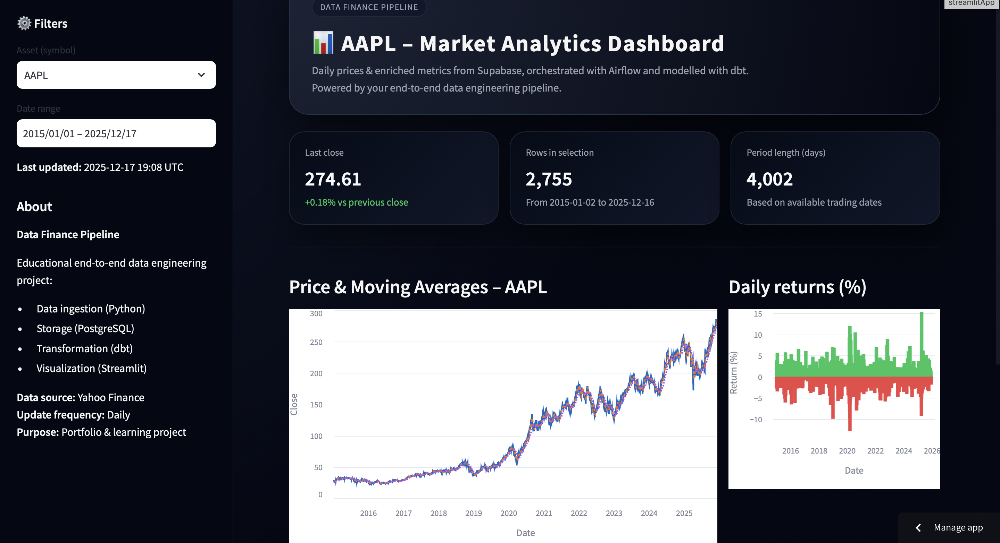
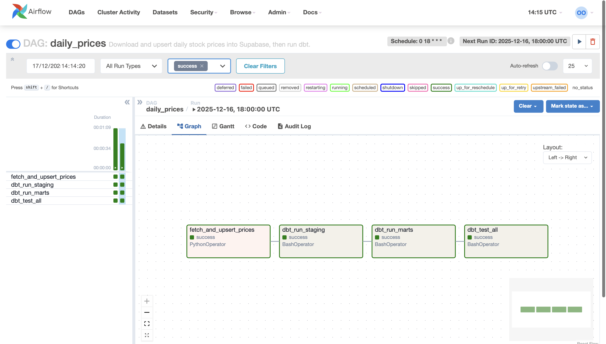

# Data Finance Pipeline (Mini-Bloomberg)
Live Demo: https://projet-solo-46o4p4svdfxef5rdevb284.streamlit.app
This project is an end-to-end data engineering pipeline built as a personal portfolio project, inspired by real-world financial data platforms.

It ingests daily market prices, stores them in Supabase Postgres, transforms them using dbt, orchestrates workflows with Airflow, and exposes analytics through a Streamlit dashboard.

---

## Tech Stack
- **Python** – data ingestion & application logic  
- **Supabase Postgres** – data storage  
- **dbt** – data modeling (staging & marts)  
- **Apache Airflow** – orchestration & monitoring  
- **Streamlit** – analytics dashboard  
- **Docker Compose** – local development environment  

---

## What the Pipeline Does
1. Fetches daily OHLC prices per asset and upserts them into `public.raw_prices`
2. Transforms raw data with dbt into analytics-ready models:
   - `dim_asset`
   - `dim_calendar` (derived from actual trading dates)
   - `fact_prices`
   - `fact_prices_enriched` (returns & moving averages)
3. Serves analytics through a Streamlit dashboard:
   - asset & date filters  
   - key KPIs  
   - price and return charts  
   - CSV export
4. Logs each pipeline run into `etl_run_log` and sends failure alerts via Discord webhook

---

## Quickstart (Local)

### 1) Environment Configuration
Create a `.env` file at the project root (do **not** commit it):

```bash
SUPABASE_HOST=...
SUPABASE_PORT=6543
SUPABASE_DB=postgres
SUPABASE_USER=...
SUPABASE_PASSWORD=...
DISCORD_WEBHOOK_URL=...   # optional


```

### 2) Start the Stack
From the project root:
```bash
docker compose up --build
```


This starts Airflow, installs dependencies, and prepares the local environment.

### 3) Run dbt Models
From the dbt project directory:
```bash
cd dbt/data_finance_pipeline
dbt run
dbt test
```
This builds the staging and marts models and validates data quality with tests.


### 4) Run the Streamlit Dashboard
From the project root:
```bash
streamlit run app/app.py
```
The dashboard will be available locally and display the full historical dataset.

## Screenshots

### Streamlit Dashboard


### Airflow DAG



## Notes
The pipeline currently runs locally but is designed with production-like patterns (idempotent ingestion, dimensional modeling, orchestration, logging).
Calendar and fact models are derived directly from real trading data to avoid data loss during joins.
The project focuses on clarity, robustness, and reproducibility rather than over-engineering.

## Disclaimer
This project is for educational and portfolio purposes only.
Data is sourced from public APIs (Yahoo Finance) and may contain inaccuracies.
This is not financial advice.
